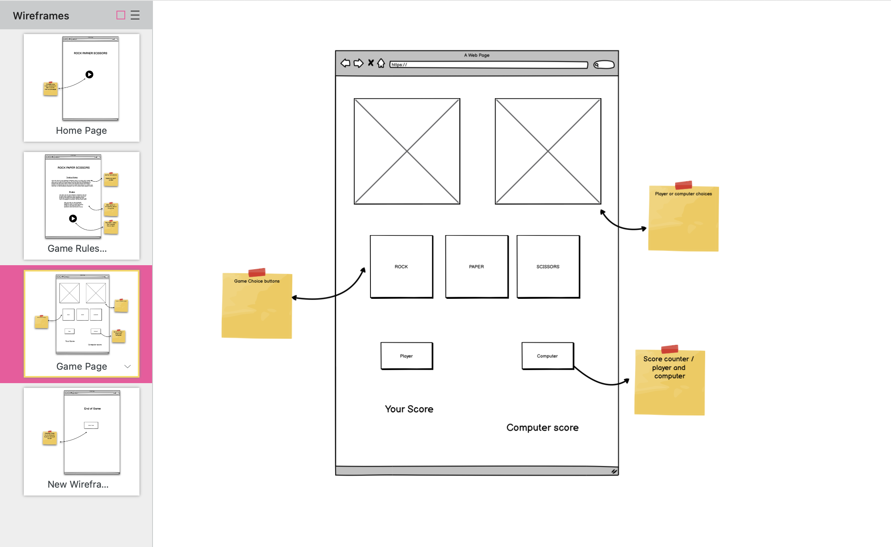
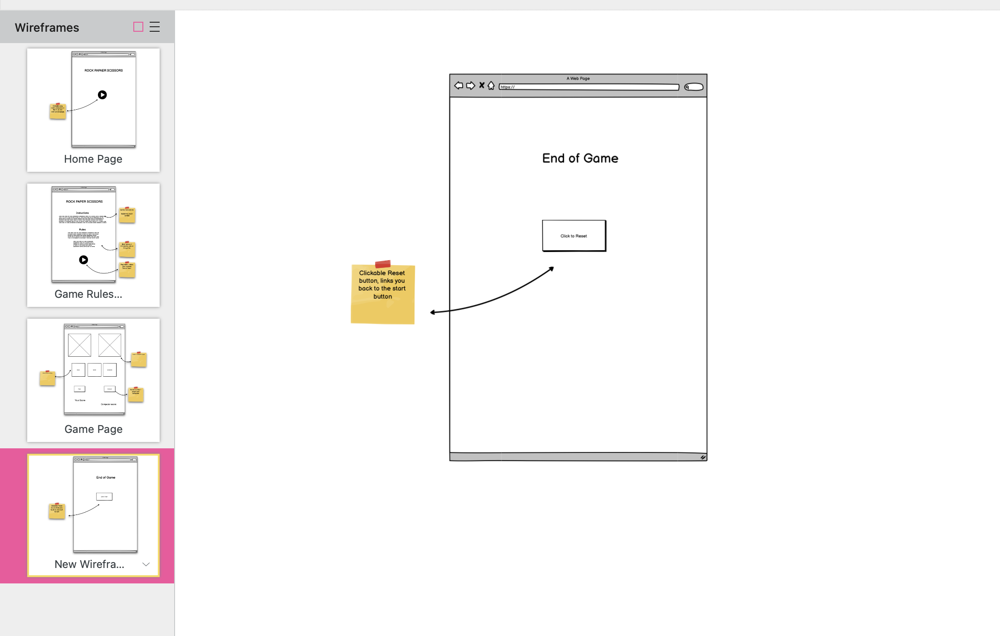

# Rock Paper Scissors 

The Rock Paper Scissors game is a platform game to be played on all devices. You will play against the computer and try to beat the computers score. Rock wins against scissors, Scissors wins against paper and Paper wins against rock. Try to guess what the computer will choose and see if you can outsmart the computer by choosing the better option. For each time you win, you gain a point. 

# List of Contents
<li><a href="#home-page">Project Purpose</a></li>
<li><a href="#user-stories">User Stories</a></li>
<li><a href="#target-audience">Target Audience</a></li>
<li><a href="#future-features">Future Features</a></li>
<li><a href="#typography">Typography & Color Scheme</a></li>
<li><a href="#wire-frames">Wireframes / flow chart</a></li>

---

# Features 
<li><a href="#start-game">start Game</a></li>
<li><a href="#game-area">Main Game Area</a></li>
<li><a href="#game-title">Game Title</a></li>
<li><a href="#buttons-area">Buttons</a></li>
<li><a href="#footer">Footer</a></li>
<li><a href="#about">About Us</a></li>
<li><a href="#listen">Listen</a></li>
<li><a href="#sign-up">Sign Up</a></li>
<li><a href="#future-features">Future Features</a></li>

---

# Technologies 
<li><a href="#testing">Testing</a></li>
<li><a href="#browser-tests">Browser Tests</a></li>
<li><a href="#responsive-design">Responsive Design</a></li>
<li><a href="#lighthouse-test">Lighthouse tests</a></li>
<li><a href="#deployment">Deployment</a></li>
<li><a href="#mark-up">Mark up</a></li>

---

# Errors and Debugging
<li><a href="#debugging">Debugging</a></li>
<li><a href="#gitgub">Github</a></li>

---

# Extras
<li><a href="#credits">credits</a></li>
<li><a href="#acknowledgments">Acknowledgments</a></li>

---

### Start Game
- The homepage to the game displays the start button. Once clicked you will be navagated to the game instructions page. By keeping the game plateform simple and user friendly, I decided to show a large button and with a round shape. This is to keep within the traditional button design for a user to be more familiar with the platform. 
 

---

# User Stories
- As a user I would like to have an easy understanding of how to play this game.

- When reading the instructions I want it to be informative but kept short with instructions 

- I want to be able to navigate easly from the very start of the game with just the click of a button. 

-  When playing the game, I expect the game to function correctly with my choices and if playing the computer, it functions as to how the game is explained in the instructions.

- I would like to see a scoring counter for my score and the computers score.

- As games are fun, I want to see bright colors or fun images to keep it exciting. I want to also see interactive feartures that give detail to the game.  

### Game Title
- The game title Rock Paper Scissors gives the user a good idea as to what the game maybe about. This will keep the user guessing and to try and encourage the user to play the game.  

### Game area
- The mian game area is where the fun begins. Here the user will be able to use the game fucntions dislayed and interact with the game. The game area is set out to be to easy to read and use. The use of colours and icons will help keep the game interesing and to explain each function with matching icons as to its function. 

- add to add picture of main game area!!

### Buttons area
- All buttons are displayed with text to give the user a better understanding of what button functions do once clicked.  

---

- For mobile screen sizes of a max-width 300px, the images and links are removed. This is to reduce the amount of information displayed on smaller sizes as lots of content can be harder to read on this screen size.

---

### About 
- The about us page gives the user a brief piece of information on the creators behind the idea - Who are we? It creates a trustworthy feel on management of the website before entering personal details and signing up.

- Styling for the header image is copied from the main homepage to provide a sense of symmetry and keeping the idea that the website is about listening.

- Below the about us section is the address of the company, this is also shared to create trust with the website.

---

### Listen
- The listen page is where the user will find five podcast samples to try out by just clicking on a link under each explanation of a topic.

- The images (left) will give the user a visual way of knowing what type of topic will be covered. Images are also used to give color to the page.

- A brief piece of text (right) along side each image will explain to the user what this topic covers.

- A link description added above each clickable link will give the user information on what and who they will be listening to before clicking.

- In mobile screen sizes of a max-width 300px, the listen page will have a new layout, this is to be more user friendly when lookin at the images and text.

---

### Sign Up 
- The sign up page is the final page to explore, this page gives the user an opportunity to enter personal information and sign up.

- Personal details required - first name, last name, email, user name, password.

- For design and styling, the sign up page uses a background image. It is intended to give the user an idea that this is separate from the other pages but also keeping the theme of the website. The use of a yellow border is to highlight the form more clearly over the bright background image.

- Once the user has entered all information correctly, they will be navigated to a thank you page. This is to give conformation to the user that their personal detials have been sent.

---

# Future features 
- need adding 

---

# Typography 
- All font family styling was used with an open source - Google Fonts
https://fonts.google.com/

- Font family used for the body - Audiowide "regular 400"
https://fonts.google.com/specimen/Audiowide

- Default setting  - "sans serif"

- All icons are taken from an open source - fontawesome
https://fontawesome.com/

---
# Colors 
- All colors are picked using a Adobe colour wheel. I used a color chart which features colur trends for game design .

- The backgorund colour is set to a dark purple to give more contrast to the lighter game colours. ( #021226 )

-  For the main game area, I used a medium shape of pink to bring more excitement to the game and in which complaints the background color. ( #4E458C )

- The start button uses a lighter shaped of pink to complement both the game area and main background color. This keeps a nice flow of shades and to reduce complexity when useing colors. ( #A9A7D9 )

- Game title uses a meduim green to stand out from the shades of pink. Pink and green should never be seen, but as it's a fun game, I decided it's aloud. ( #02733E )

- I used yellow as a highlight icons and for when the mouse cursor hoovers over the start button. This helps to break up colors but also to give interactions with certain events. ( #C6D93B )

- All colors are taken from an open source - Adobe Color Wheel
https://color.adobe.com/trends/Game-design

- Background color for body - #021226 "dark puple"
- Start Button - #4E458C " meduim pink"
-  Game title - #02733E " meduim green" 
-  Game body - #C6D93B  "Yellow"

- add picture!!

# Content
- The game idea was taken from the original game and uses the same set of rules. All styling and icons are my own style. 
---
# Target audience
- This game is intended for all ages and for anyone who takes an interest into playing platform games. The game plateform is very simple to use and gives clear instructions on how to play the game. 

---
# Wire frames
- Design plannng and game layout was achieved using Balsamiq Wireframes

 
 - For the game operation I used Lucid Chart, to create a flow chart in planning and creating the game functions. 
 https://lucid.app/lucidspark.com

# Technologies

- html 5

- CSS

- JavaScript 

### Testing

- html valadation / css valadation JS valadation!!

___

### Browser Tests
 - Google Chrome

 - Safari 

 ---  

### Responsive design 
- add to https://ui.dev/amiresponsive to get images!!

### Lighthouse test
The Rock Paper Scissors game was tested using Lighouse In Google developer tools. All pages were testen on performance, accessibility, best practice and SEO. 

- add images!!!

- Start Button

- add lighthouse picture for each gaem page

- Game rules

- main game area

- game score

- game reset

# Deployment 
- The Podcast Project was deployed through Gitpod and added to Github. From here you access the live link to the site. 
https://github.com/

- Within github you can select the repository for the project. After selecting the repository click setting on the left hand side and pick pages within the options. From here you can click the live link to the website at the top of the page. 
https://www.gitpod.io/

- Add website live link !!!!!!

# Mark up

- 

---

### Debugging

---

# Credits
- The Rock Paper Scissors project was developed using html, css and JavaScript. 

---
# Acknowledgments
- 

